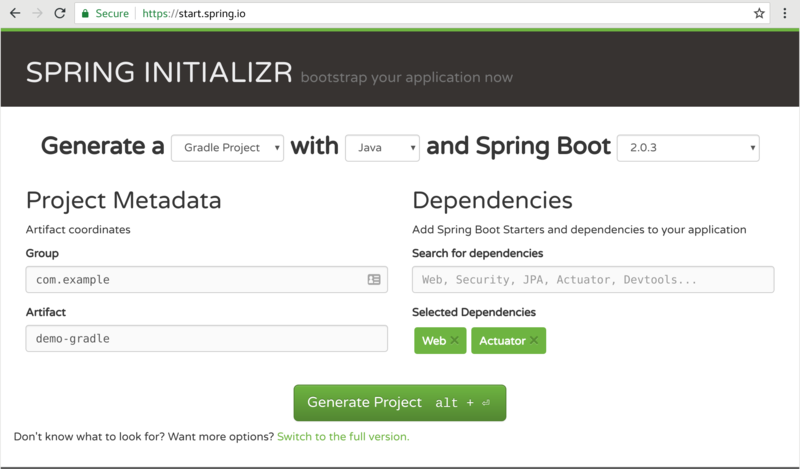
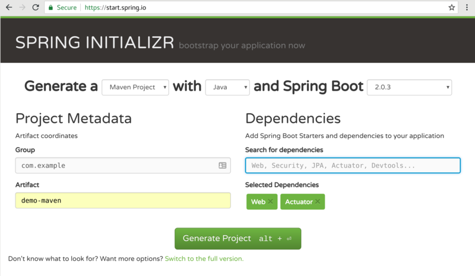

### Spring Demo

Start from scratch.

##### Step 1 - Generate source code

Generate gradle and maven spring boot projects from:

```
-- http://start.spring.io/
```

They are also checked into this repo as `zips/demo-gradle.zip` and `zips/demo-maven.zip`




##### Step 2 - Maven Build & Deploy

Create a working folder

```
unzip zips/demo-maven.zip && cd demo-maven
```

Run shell script to setup codebase

```
../bin/do-demo-maven-spring-boot.sh
```

Test locally

```
mvn spring-boot:run

$ curl localhost:8080/api/hello/mike

{"response":"default hello","count":0,"your-name":"mike"}
```

Deploy to OpenShift

```
oc new-project spring-demo --display-name='SpringBoot Demo' --description='SpringBoot Demo'
oc policy add-role-to-user view --serviceaccount=default -n $(oc project -q)
mvn fabric8:deploy
```

Test on OpenShift

```
$ curl $(oc get route demo --template='{{ .spec.host }}')/api/hello/mike

{"response":"default hello","count":0,"your-name":"mike"}
```

Deploy ConfigMap and redeploy pod

```
oc create -f configmap.yaml
oc delete pod -l app=demo
```

Test new message from ConfigMap

```
$ curl $(oc get route demo --template='{{ .spec.host }}')/api/hello/mike

{"response":"hello, spring cloud kubernetes !","count":0,"your-name":"mike"}
```

Create a Secret and redeploy pod (note triggers do this on DC)

```
oc create -f secret.yaml
oc set env --from=secret/helloservice dc/demo
```

Test new message from ConfigMap & Secret

```
$ curl $(oc get route demo --template='{{ .spec.host }}')/api/hello/mike

{"response":"hello, spring cloud kubernetes !","count":0,"your-name":"mike"}
```

##### Step 3 - Gradle Build & Deploy

Create a working folder

```
unzip zips/demo-gradle.zip && cd demo-gradle
```

Run shell script to setup codebase

```
../bin/do-demo-gradle-spring-boot.sh
```

Test locally

```
./gradlew build bootRun

$ curl localhost:8080/api/hello/mike

{"response":"default hello","count":0,"your-name":"mike"}
```

Deploy to OpenShift

```
oc new-project spring-demo --display-name='SpringBoot Demo' --description='SpringBoot Demo'
oc policy add-role-to-user view --serviceaccount=default -n $(oc project -q)
oc new-build --strategy=source --name=demo-gradle-s2i --binary -l app=demo-gradle-s2i -i openshift/redhat-openjdk18-openshift:1.3
oc start-build demo-gradle-s2i --from-file=build/libs/demo-gradle-0.0.1-SNAPSHOT.jar
oc new-app demo-gradle-s2i
oc expose service demo-gradle-s2i
```

Test on OpenShift

```
$ curl $(oc get route demo-gradle-s2i --template='{{ .spec.host }}')/api/hello/mike

{"response":"default hello","count":0,"your-name":"mike"}
```

Deploy ConfigMap and redeploy pod

```
oc create -f configmap.yaml
oc delete pod -l app=demo-gradle-s2i
```

Test new message from ConfigMap

```
$ curl $(oc get route demo-gradle-s2i --template='{{ .spec.host }}')/api/hello/mike

{"response":"hello, spring cloud kubernetes !","count":0,"your-name":"mike"}
```

Create a Secret and redeploy pod (note triggers do this on DC)

```
oc create -f secret.yaml
oc set env --from=secret/helloservice dc/demo-gradle-s2i
```

Test new message from ConfigMap & Secret

```
$ curl $(oc get route demo-gradle-s2i --template='{{ .spec.host }}')/api/hello/mike

{"response":"hello, spring cloud kubernetes !","count":0,"your-name":"mike"}
```

##### Step 4 - Tidy Up

```
oc delete project spring-demo
rm -rf demo-gradle/ demo-maven/
```
